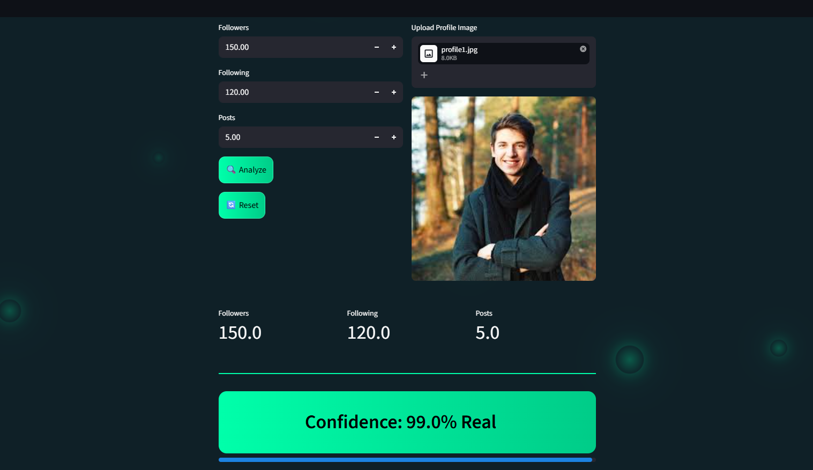
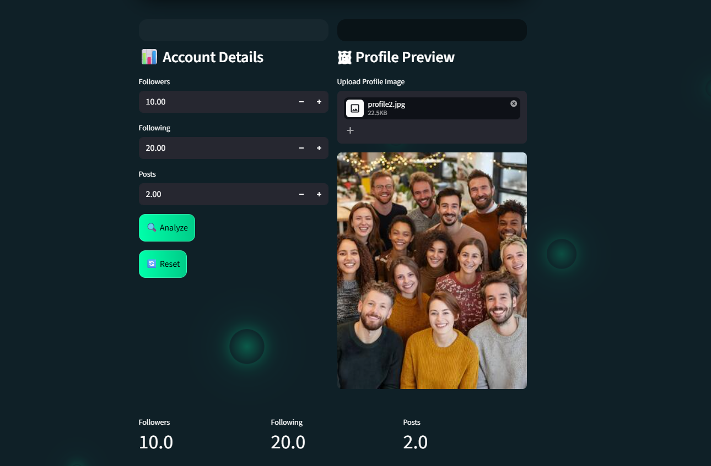

# fake-account-detector
Machine learning-based system for detecting fake social media profiles using behavioral data and image analysis.

Features--
ML-based fake account detection
Profile image analysis (face detection)
Confidence score
AI explanation
Modern UI with animations

Tech Stack--
Python
Streamlit
Scikit-learn
OpenCV

working--
Run Locally
pip install -r requirements.txt
streamlit run app.py

## 📸 Screenshots

### 🏠 Home Page

### ✅ Real Account Detection

### 🚫 Fake Account Detection

